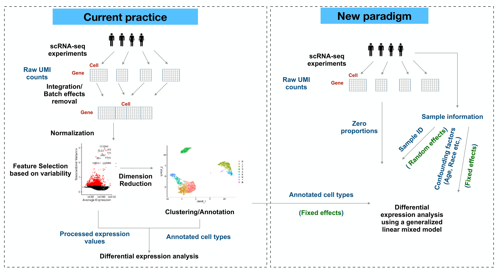

# Motivation

Differential expression (DE) analysis in single-cell transcriptomics reveals cell-type-specific responses. Recent studies have raised concerns about current methods used to identify differentially expressed genes in this context.  

- scRNA sequencing provides the absolute abundances of RNA molecules in single cells, but normalization - a pre-processing step inherited from the bulk RNA-seq era - reduces this information and returns data as relative abundances, which may mask important differences among cell types  

- The majority of single-cell DE analysis methods are susceptible to generating false discoveries. This is mainly due to the lack of accounting for variations between biological replicates, commonly referred to as "donor effects". 
    - Batch effects are often estimated from leading principal components, representing a consensus from most genes.
    - Pseudo-bulk analysis ignores within-sample heterogeneity by treating donor effects as a fixed effect and assuming that each cell from the same donor is equally affected. 

- Clustering and DE analysis are different problems. The current commonly workflow works well in clustering, but cannot guarantee success in downstream analysis.  

- Excessive zeros are usually considered as "drop-outs", while they are actually informative in cell-type heterogeneity. Ignoring zeros in single-cell gene expression data discards valuable information for any analysis.

We provided a generalized linear mixed model framework ([LEMUR](https://github.com/C-HW/LEMUR): Linear mixed model-based differential Expression analysis accounting for Multiple samples Using Random effects) to detect differentially expressed genes (DEGs) between two given cell types. The model takes donor-specific variations as random effects, and uses raw UMI counts to prevent biases in DE analysis.

# LEMUR framework

By default, we excluded any genes detected in fewer than 5% cells in the compared groups from differential testing. The GLMMs were implemented with glmmPQL function of the MASS package. We calculated adjusted p-values by using Benjamini-Hochberg correction. Each model fitting was applied on one gene and the two compared groups.

## Poisson-glmm
For each count $X_{cgk}$ sampled from cell $c$, donor $k$, and gene $g$,

$$
\begin{aligned}
    X_{cgk}|\lambda_{cgk} & \sim Poisson(\lambda_{cgk})\\
    \log \lambda_{cgk} & = \mu_g + X_c{\beta_g} + \epsilon_{gk}\\
\end{aligned}
$$
where $X_c$ is the indicator for different cell types, and $\epsilon_{gk}\sim N(0,\sigma_{g}^2)$ represents the random effects for donor $k$. Our goal is to test $H_0: \beta_g = 0$. Here $e^{\beta_g}$ represents the fold change of gene $g$ between two cell types.

## Binomial-glmm

$$
\begin{aligned}
    \mathbb{1}_{X_{cgk}=0}|p_{cgk} & \sim Bernoulli(p_{cgk})\\
    \log \frac{p_{cgk}}{1-p_{cgk}} & = \mu_g + X_c\beta_{g} + \epsilon_{gk}\\
\end{aligned}
$$
where $X_c$ is the indicator for different cell types, and $\epsilon_{gk}\sim N(0,\sigma_{g}^2)$ represents the random effects for donor $k$. Our goal is to test $H_0: \beta_g = 0$. 

For both methods, we provided “log2 fold change” computed by $\log_2(\beta_g)$ . In Poisson-glmm, this estimate indicates the increment of $\log_2(\lambda_2)$ against $\log_2(\lambda_1)$, which is the conventional log2 fold change. However, this term in Binomial-glmm doesn’t represent the same meaning. It is the difference between logit($p_2$) and logit($p_1$). The p-value and BH adjusted p-value are provided.

# Benchmarked methods

In this project, we compared a few methods performing the DE analysis results. Our comparison encompassed Poisson-glmm and Binomial-glmm from the new paradigm, as well as pseudo-bulk approaches including DESeq2 and edgeR. Additionally, we assessed the performance of single cell specific tools including MAST, Wilcox in Seurat, and linear mixed models in Muscat. More details can be found [here](methods_details.html).

# New criteria on determining DEGs

We proposed new criteria that based on the convention and also the gene mean and the difference in mean. If the log2 gene mean in two groups is lower than a certain value (-2.25 in case study 1) and the log2 mean difference is smaller than a threshold (-1 in case study 1), the genes would not be considered as a DEGs. These can also be used as a filter before any DE analysis to speed up the computation. Both of these criteria are adjustable, depending on the dataset’s performance and characteristics. An examination in heatmaps and mean difference against mean plot in advanced can be helpful to determine the thresholds when analyzing a new dataset. More details can be found [here](new_criteria.html).

# Application

## Case study 1
 
In case study 1, a 10X scRNA-seq dataset of post-menopausal fallopian tubes, with 57,182 cells sourced from five donors, covering 29,382 genes is analyzed. The 20 clusters are obtained via HIPPO algorithm. There is no pre-filtering procedure applied on this dataset, except for built-in filtering steps in each method. We use sctransform to get the VST data, and the integration workflow provided by Seurat to obtain the integrated data.
  
* [Data summary](data_clusters.html)
  
* Analyses
  
  + [Group12_13](group12_13.html)  
  + [Group2_19](group2_19.html)  
  + [Group8_17&2_19](group8_17-2_19.html)
  + [Group12_19](group12_19.html)
  + [Group8_17](group8_17.html)

## Case study 2

In case study 2, the dataset contains 10X droplet-based scRNA-seq PBCM data from 8 Lupus patients obtained before and after 6h-treatment with IFN-β. After removing undetected genes and lowly expressed genes (less than 10 cells expressing more than 1), the dataset consists of 29065 cells and 7661 genes. The integrated data is replaced by log2-transformed normalized expression values obtained via computeLibrarayFactors and logNormCounts functions in Muscat.

* [Data summary](data2.html)

* Analyses

  + [CD14+ Monocytes](CD14+-Monocytes.html)
  + [B cells](Bcells.html)
  + [P-values under null setting](FD_analysis.html)
  
## Permutation analysis

To examine the p-value calibration in real data, we did a permutation analysis on group-of-interest within a null dataset. The results can be found [here](FD_analysis.html).